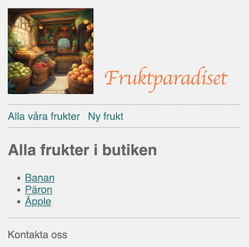

# Webbserverprogrammering 1 - Övning 2
Exempel-projekt nummer 2 med övningar till kursen Webbserverprogrammering 1 på NTI Gymnasiet Johanneberg.
Efter genomgång görs övningar nedan **i par**.

## Komma igång
* Ladda ner repositoriet till mappen Webbserverprogrammering på din dator. Antingen som ZIP (isåfall måste du packa upp ZIP-filen) eller så laddar du ner med: `git clone`
* Installera: `bundle install`
* *Seeda* databasen: `rake seed`
* Köra: `rake dev`
* Surfa till: http://localhost:9292

## Länkar
* https://sqlbolt.com/
* https://sqlitebrowser.org/

## Genomgång 1
* Visa routes `GET /fruits` och `/views/fruits/index.erb`
* Visa `layout.erb`
* Visa SQL:
    * *DB Browser for SQLite*
    * *SQLBolt*
    * `db/seeder.rb`
    * `db/fruits.sqlite`
    * `app.rb/db-metoden`
    * `views/layout.erb`
    * `db.execute('SELECT * FROM fruits WHERE id=?',id).first`

### Uppgifter 1
1. Gör *SQLBolt* t.o.m. **övning 2**.
2. Testa att sortera om frukterna på t.ex. ID. Du behöver uppdatera SQL-koden: `db.execute('SELECT * FROM fruits')`
3. Lägg till ca 5 nya frukter mha. `db/seeder.rb`. För att spara datan till databasen kör du `rake seed`
4. Öppna databasfilen i DBBrowser och dubbelkolla så du ser din data även där.
5. Visa all info om en frukt på routen `'/fruits/:id'`
6. Lägg till mer data eller funktioner som t.ex.
    * Visa stjärnor istället för ett nummer för fruktbetyg
    * Lägg till fler kolumner i databasen som t.ex. vilket land en frukt kommer ifrån eller hur mycket den kostar / kg
    * Lägg till testdatan mha. *DB Browser*
    * Lägg till testdatan mha. `db/seeder.rb`. Vad hände med datan du la till i *DB Browser*?

## Genomgång 2
* Hur hänger allt ihop?
* `db.execute('SELECT * FROM fruits WHERE id=?',id).first` (igen)
* Ruby hashes
* SQL Injections

### Uppgifter 2
1. Gör *SQLBolt* t.o.m. **övning 10**.
2. Gör alla uppgifter på #1
3. Lägg till funktioner du kan komma på till fruktshoppen
4. Börja kämpa med nästa veckas uppgifter (uppgifter #3)

## Genomgång 3
* Föreläsningen: **5 - Ta bort frukt + Spara ny frukt**
* [HTTP Requests & Response + GET & POST](https://ntijoh.github.io/webbserverprogrammeringsboken/#_requests_routing) (till Routes for *CRUD*)
* [Formulär](https://ntijoh.github.io/webbserverprogrammeringsboken/#_formul%C3%A4r)
* SQL: [Delete](https://ntijoh.github.io/webbserverprogrammeringsboken/#_action_delete_route_messagesiddelete_method_post) & [Inserts](https://ntijoh.github.io/webbserverprogrammeringsboken/#_insert)
* Params

### Uppgifter 3
1. Gör en knapp (& formulär) som tar bort en frukt.\
   Använd routen: `post '/fruits/:id/delete'`
2. Rita ett sekvensdiagram för hur det ser ut när ni sparar en ny frukt. Bifoga det i din loggbok. Använd: https://www.websequencediagrams.com/app
3. Lägg till ett formulär för att spara en ny frukt.\
   Använd routen `GET '/fruits/new'` och filen `new.erb`
4. Gör routen som sparar datan till databasen: `POST '/fruits/new'`.
5. Arbeta vidare med *SQLBolt*
6. Utöka funktionerna.
    * Utforska och lägg till de funktioner du tycker behövs
    * Lägg till bilder (eller ikoner) till frukterna
    * Börja kämpa med nästa veckas uppgifter (#4)

## Genomgång 4
* Föreläsning: **6 - Uppdatera en frukt**
* [Uppdatera data](https://ntijoh.github.io/webbserverprogrammeringsboken/#_action_edit_route_messagesidedit_method_get)
* C.R.U.D.

### Uppgifter 4
1. Gör ett sekvensdiagram för hur uppdateringen av en frukt går till. Lägg det i loggboken.
2. Lägg funktioner för att uppdatera datan för en frukt
3. Samanfatta i loggboken vad du lärt dig på dessa 4 lektioner. Markera även i betygsmatrisen (i loggboken) vad du tycker du kan och inte kan.
4. Gör *SQLBolt* t.o.m. **övning 15**.
5. Lägg till kategorier för frukter & grönsaker
6. Lägg till funktioner du tycker + gör färdigt allt du inte hunnit tidigare
